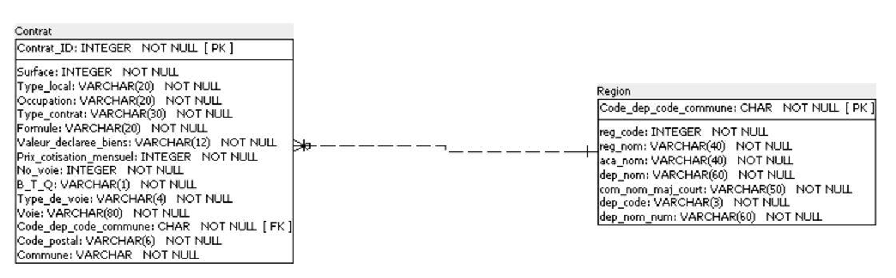
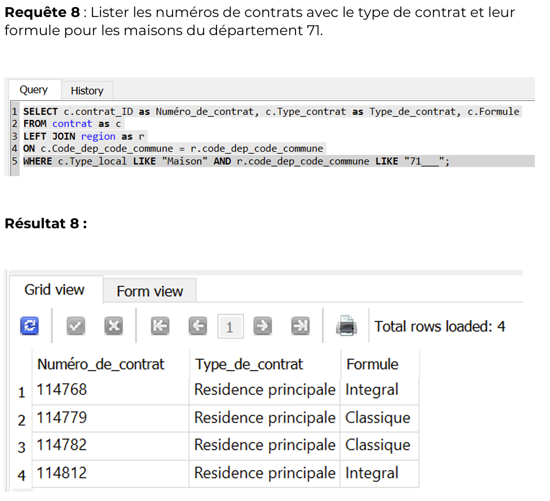
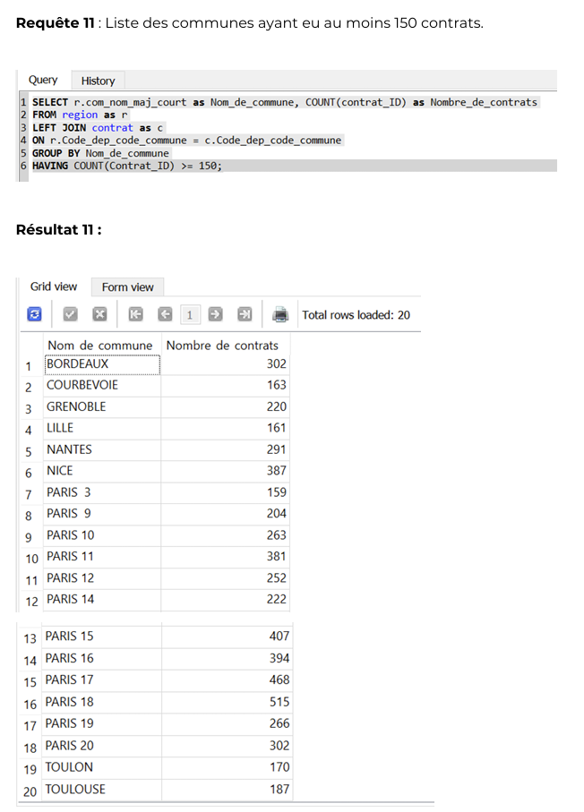
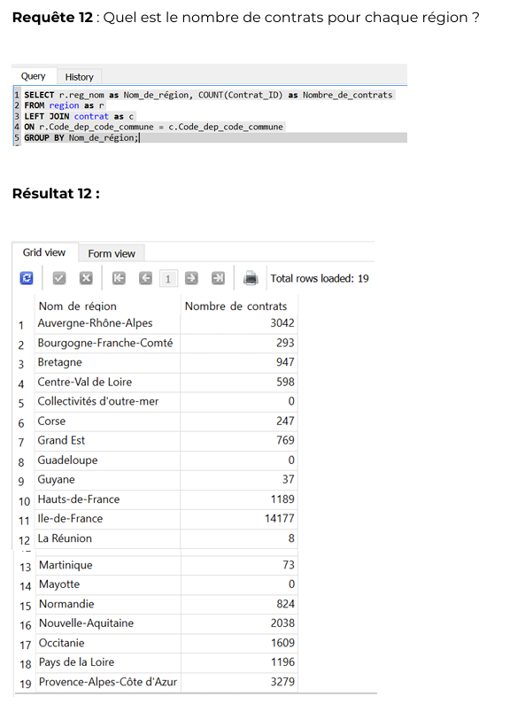

# Projet 3 - Requêtez une base de données avec SQL

## Contexte du projet

L'objectif de ce projet est d'expliquer l'utilité de faire des **requêtes de bases de données avec SQL** et de proposer une **méthodologie claire à suivre** pour analyser les données et répondre à des problématiques business.

---

## Objectifs pédagogiques

- Charger des données dans une base de données
- Créer un **schéma de base de données**
- Rédiger des **scripts SQL simples** pour aider à la prise de décision business

---

## Outils utilisés

- **SQL**

---

## Résultats du projet

La méthodologie adoptée repose sur plusieurs étapes clés :

La première consiste à prendre connaissance des types de données à traiter à l’aide d’un **dictionnaire de données**.  
Ce document regroupe :
- Le nom des colonnes
- Le type de données
- La taille
- Les clés
- Une description des champs  

Ces informations permettent de mieux comprendre les données qui seront exploitées.

La deuxième étape est la création du **schéma relationnel**.  
Celui-ci permet de visualiser les différents éléments présents dans chaque table et de préciser les relations entre elles, notamment à l’aide des **clés primaires et secondaires**.

Enfin, avant de se lancer dans la rédaction des requêtes SQL, il est essentiel de se demander ce que signifie *« répondre à une requête »*.  
La démarche consiste à **commencer par la fin**, en imaginant le **résultat final attendu**, afin d’identifier précisément le contenu des lignes et des colonnes à obtenir.

Vous trouverez ci-dessous quelques exemples de requêtes réalisées dans le cadre de ce projet.

---

## Compétences acquises

- Création d’un **dictionnaire de données**
- Création d’un **schéma relationnel**
- Rédaction et exécution de **requêtes SQL**

---

## Illustrations

### Schéma relationnel

### Exemples de requêtes SQL

  
  

